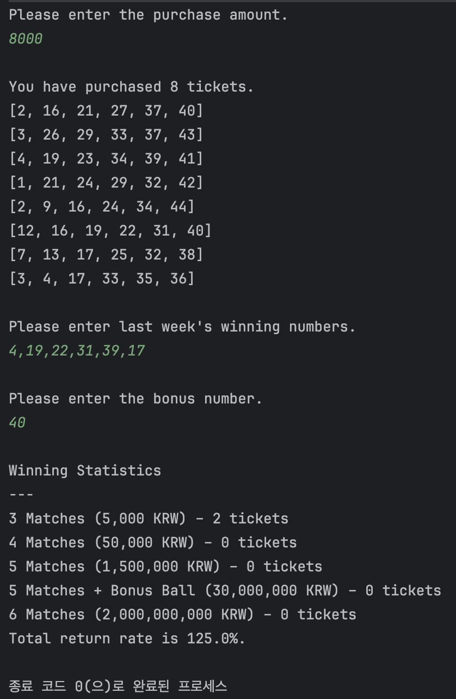
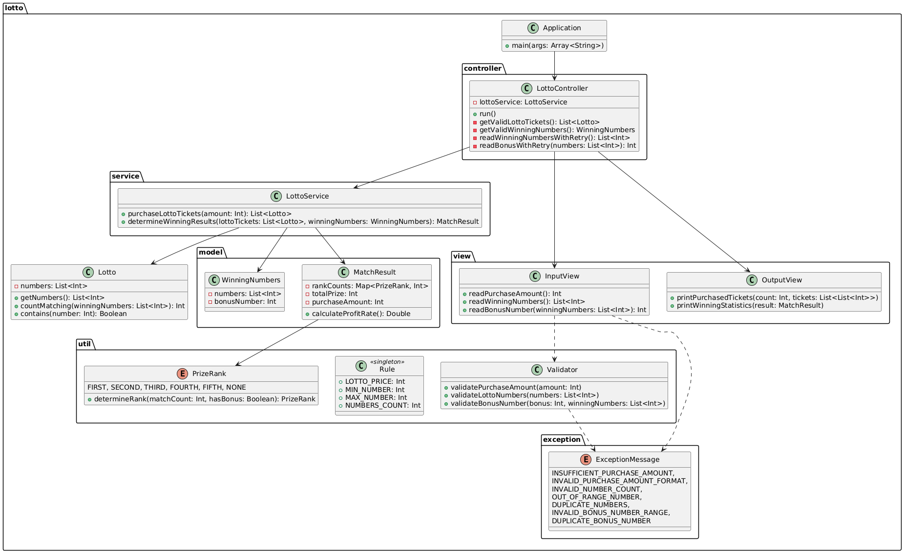
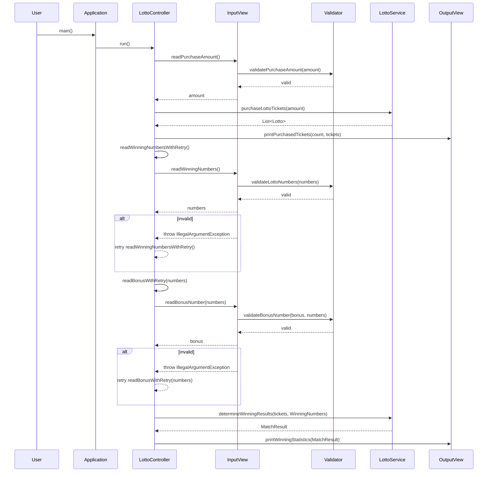

# kotlin-lotto-precourse

## 0. Folder structure
```bash
.
└── lotto
    ├── Application.kt
    ├── Lotto.kt
    ├── controller
    │   └── LottoController.kt
    ├── exception
    │   └── ExceptionMessage.kt
    ├── model
    │   ├── MatchResult.kt
    │   └── WinningNumbers.kt
    ├── service
    │   └── LottoService.kt
    ├── util
    │   ├── PrizeRank.kt
    │   ├── Rule.kt
    │   └── Validator.kt
    └── view
        ├── InputView.kt
        └── OutputView.kt
```

## 1. Overview
A simple command-line Lotto application.
1. User enters a purchase amount (must be at least ₩1,000 and divisible by ₩1,000).
2. The app generates that many random tickets (6 unique numbers between 1–45).
3. User enters last week’s winning numbers (6 numbers) and a bonus number.
4. The app displays:
    - Each ticket’s numbers
    - A summary of how many tickets hit 3, 4, 5 (+bonus), or 6 matches
    - Total return rate (prize / purchase * 100%)
5. Result example:</br>


---

## 2. Role of each Dir/Files

### Application.kt (Entry Point)
> - Calls `LottoController.run()` to start the flow.

### lotto. `Lotto.kt`
> - Represents a single ticket.
> - Validates numbers on init.
> - `countMatching(…)` and `contains(…)` helpers.

### controller/
#### `LottoController.kt`
> - Orchestrates: read input -> generate tickets -> read winning numbers -> compute results -> print output
> - Catches invalid input and re-prompts recursively.

### service/
#### `LottoService.kt`
> - `purchaseLottoTickets(amount: Int): List<Lotto>`
>   - Generates `amount / 1000` tickets with 6 unique random numbers.
> - `determineWinningResults(…)`: compares each ticket to winning numbers + bonus, tallies counts and total prize.

### model/
#### `WinningNumbers.kt`
> - Holds the 6 winning numbers + bonus.
#### `MatchResult.kt`
> - Stores counts per `PrizeRank`, total prize money, and purchase amount.
> - `calculateProfitRate()` returns a percentage.

### view/
#### `InputView.kt`
> - Prompts user via `Console.readLine()`.
> - Delegates parsing & validation to `Validator`.
#### `OutputView.kt`
> - Displays purchased tickets and formatted winning statistics (using commas, one decimal for rate).

### util/
#### `Rule.kt`
> - Central constants:
>   - `LOTTO_PRICE = 1000`
>   - `MIN_NUMBER = 1`, `MAX_NUMBER = 45`
>   - `NUMBERS_COUNT = 6`
#### `Validator.kt`
> - `validatePurchaseAmount`, `validateLottoNumbers`, `validateBonusNumber`
> - Throws `IllegalArgumentException` with a message from `ExceptionMessage`.
#### `PrizeRank.kt`
> - Enum of ranks (FIRST…FIFTH, NONE) with `matchCount`, `requiresBonus`, `prizeMoney`.
> - `determineRank(matchCount, hasBonus)` mapping logic.

### exception/
#### `ExceptionMessage.kt`
> - Enum of all error cases with consistent, localized messages.

# 3. Validation Rules

- **Purchase Amount**
   - Must be at least `Rule.LOTTO_PRICE`
   - Must be divisible by `Rule.LOTTO_PRICE`

- **Lotto Numbers**
   - Must contain exactly `Rule.NUMBERS_COUNT` numbers
   - Each number must be between `Rule.MIN_NUMBER` and `Rule.MAX_NUMBER`
   - All numbers must be unique

- **Bonus Number**
   - Must be between `Rule.MIN_NUMBER` and `Rule.MAX_NUMBER`
   - Must not duplicate any of the winning numbers


# 4. UML
> This image was generated using [PlantUML](https://www.planttext.com/) based on the contents of `docs/lotto.puml`.

> Note: The `model` package contains only pure DTO classes (e.g., `WinningNumbers`, `MatchResult`) for data transfer between layers. The `lotto` package houses the domain entity `Lotto`, which performs validation via `Validator` on instantiation and provides business methods like `countMatching()` and `contains()`. This separation adheres to package constraints while clearly distinguishing domain logic from data transfer responsibilities, maintaining architectural consistency.



# 5. Execution Flow

