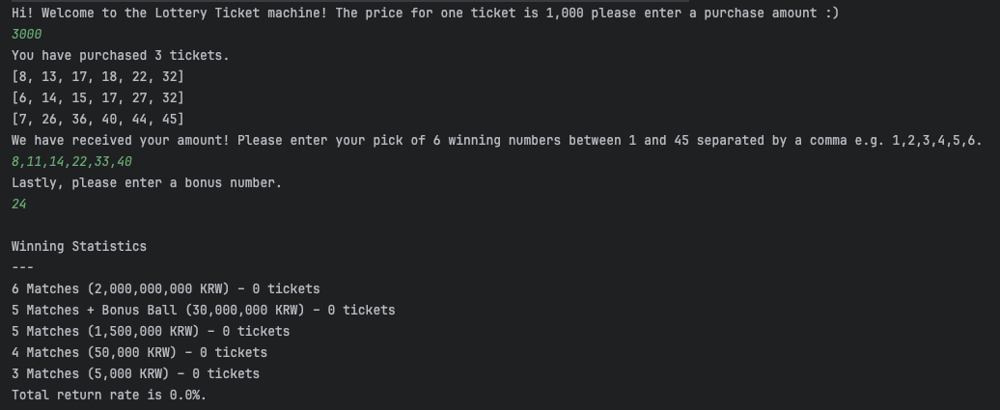
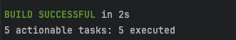

# kotlin-lotto-precourse

This project is part of the **Hero Tech Pre-course**. This repo was created with the purpose of solving Task 2, which is to implement a **Lotto game**. 
The application simulates a lottery ticket machine where users can input a purchase amount, receive randomly generated lottery tickets, input winning numbers, 
and receive statistics about their winnings and profit rate.

The application is written in **Kotlin** following feedback, guidelines, structure and requirements provided by `Hero Tech Team`. 
___
## Table of Contents

1. [Task Description](#task-description-)
2. [Feature List](#feature-list-)
3. [How to Run](#how-to-run)
4. [Testing](#testing)
5. [Reflection](#reflection)

## Task Description 

The task consists of creating a Lotto ticket system that meets the following criteria:

- Each ticket contains 6 unique random numbers (1–45).
- Each ticket costs 1,000 KRW.
- User enters a purchase amount, and receives the corresponding number of tickets.
- User enters winning numbers and a bonus number.
- The system evaluates the results and calculates the total profit rate.
- Follows Kotlin coding conventions, uses provided `Randoms` and `Console` APIs, and includes unit testing with JUnit 5 and AsserJ. 

## Feature List 

### Input Handling and Validation
- Prompt the user to input the purchase amount.
- Validate the amount is a positive integer divisible by 1,000.
  - If it is not divisible by 1,000, reject, throw error and prompt again. 
- Prompt the user to input 6 comma-separated winning numbers.
- Prompt the user to input a single bonus number.
- Validate that all numbers are:
    - Between 1 and 45 (inclusive),
    - Unique within their respective sets (winning numbers and bonus),
    - Properly formatted as integers (e.g. `2` and not `2.0`)
- Raise `IllegalArgumentException` for any invalid input.
- Re-prompt the user from the same step after an invalid input.
- All error messages are prefixed with `[ERROR]`.

### Game Logic
- Calculate how many tickets to generate based on the input amount.
- Generate tickets with 6 **unique random numbers** in the 1–45 range using `Randoms.pickUniqueNumbersInRange`.
- Compare each ticket against the winning numbers and bonus number.
- Determine match count and assign the correct prize tier:
    - 6 matches = 1st Prize
    - 5 matches + bonus = 2nd Prize
    - 5 matches = 3rd Prize
    - 4 matches = 4th Prize
    - 3 matches = 5th Prize
- Calculate the total prize money earned and compute the **return rate**.

### Output and Results
- Print how many tickets were purchased and show each ticket’s numbers, sorted in ascending order.
- Print the Winning Statistics per prize category.
- Display the total return rate, rounded to the nearest tenth (e.g. 75.5%).
- Ensure output format matches the exact structure given in the guidelines by `Hero and Woowa Tech`. 

### Tests
- Implement unit tests using **JUnit 5** and **AssertJ**.
  - Unit tests for:
    - Input validation.
    - Game logic and scenarios.
    - Ticket generation.
    - Results calculation.
- Use the provided `LottoTest` class as a reference for best practices.

## How to Run

### 1. Via IntelliJ IDEA 
1. Open the project in IntelliJ IDEA.
2. Locate the `Application.kt` file (inside `src/main/kotlin/lotto/`).
3. Right-click on the `main` function and select **Run 'ApplicationKt'**.

The program will prompt you to enter: 

* Purchase amount.
* Your pick of 6 winning numbers.
* One bonus number.

The results will be shown as `Winning Statistics` following the guidelines and format of this specific task. 

Example: 



## Testing

As per Task guidelines, this project uses JUnit 5 and AssertJ for all testing. 

You can run tests via:

### 1. IntelliJ IDEA
1. Open the project in IntelliJ IDEA 
2. Locate the desired test file inside the test directory.
3. Right-click on the file test class and select Run. 

### 2. Terminal 

```bash
./gradlew clean test
```
Expected output:



## Reflection

This project was a step up from the previous one, and now my second project building an app in Kotlin. I used external guidance and focused on clean code, test coverage, 
and structure. I learned a lot about Kotlin, testing, and code clarity during this project. Working with Kotlin logic is still where I struggle the most, but I learn best by doing,
which means a lot of trial and error. Overall it was a really positive experience for me, learning a lot by practicing and trying to use as much as IntelliJ IDE has to offer. 

### My Takeaways: 

- I got more comfortable with Kotlin and testing things in IntelliJ IDE.
- This project helped me think more about project structure. Separating things like `InputView`, `OutputView`.
- Using enums with logic (like Rank) was new for me.
- Writing tests made me catch small mistakes early, allowing me to go back, understand more of the logic, and implement changes. 
- I also practiced sticking to conventions and apply feedback to a new project — like keeping functions short, avoiding deep nesting, and naming things as clear as possible.