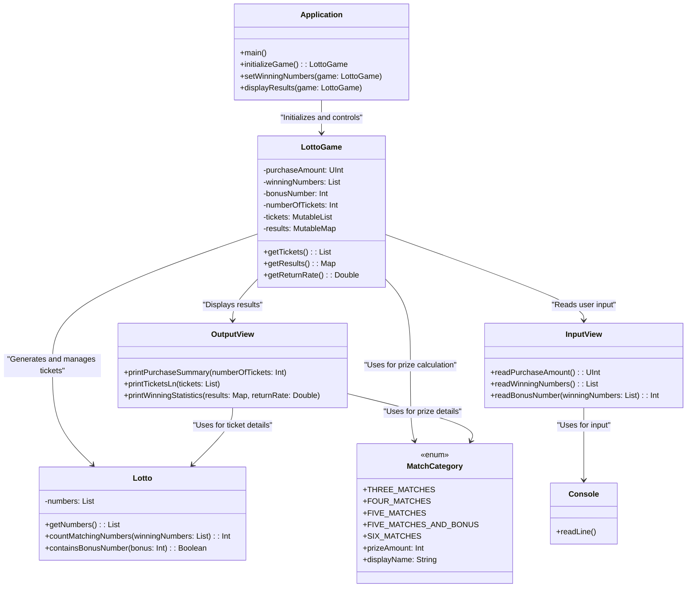

# kotlin-lotto-precourse

This is the submission for the second week's mission of the pre-course for the "Hero Tech Course: Berlin Edition" by [Deniz](https://github.com/deniz-oezdemir).

This project is a console-based Kotlin application that simulates a lotto game. After the user inputs a purchase amount, winning numbers, and a bonus number, the program generates tickets, validates inputs, calculates results, and displays winning statistics.

Below you can find a quick demonstration of the program:

https://github.com/user-attachments/assets/30746460-506f-4e27-af60-749ec28fc04e

## Table of Contents

- [Feature List](#feature-list)
  - [Input Handling](#input-handling)
  - [Error Handling](#error-handling)
  - [Ticket Generation](#ticket-generation)
  - [Prize Calculation](#prize-calculation)
  - [Result Display](#result-display)
- [Class Responsibilities and Interactions](#class-responsibilities-and-interactions)
- [Learnings](#learnings)
- [Considerations](#considerations)
- [Reflections and Future Work](#reflections-and-future-work)
- [Sources](#sources)

## Feature List

The features will be implemented in the following order:

### Input Handling

- [x] Get the purchase amount from the user.
- [x] Check if the purchase amount is valid.

  - [x] It must be a positive integer.
  - [x] It must be divisible by 1,000.

- [x] Get the winning numbers from the user.
- [x] Check if the winning numbers are valid.

  - [x] Each number must be between 1 and 45.
  - [x] There must be 6 unique numbers.

- [x] Get the bonus number from the user.
- [x] Check if the bonus number is valid.
  - [x] It must be a single number between 1 and 45.
  - [x] It must not match any of the winning numbers.

#### Error Handling

For each user input in above section *Input Handling*:
- [x] Handle invalid user input by throwing an `IllegalArgumentException`.
  - [x] Re-prompt the user for input after an error.
- [x] Ensure error messages follow the format: `[ERROR] <message>`.

### Ticket Generation

- [x] Calculate how many lottery tickets the user can buy.
- [x] Create lottery tickets for the user.
  - [x] Each ticket must have 6 unique random numbers between 1 and 45.
- [x] Display the generated tickets as required.

### Prize Calculation

- [x] Calculate results for the user's tickets.

  - [x] Check if the user's tickets match the winning numbers.
  - [x] Check if the user's tickets match the bonus number.

- [x] Define the prize amounts for the five prize ranks.
- [x] Calculate the user's winnings, if any.
- [x] Calculate the profit rate.

### Result Display

- [x] Print the winning statistics.
  - [x] Print the profit rate rounded to the nearest tenth.

## Class Responsibilities and Interactions

The following diagram shows how the classes in the project interact and their main responsibilities:

Each class has a focused responsibility, ensuring the program is modular and easy to maintain:
- `Application`: Acts as the entry point of the program. It initializes the game, sets the winning numbers, and displays the results.
- `LottoGame`: Manages the core game logic. It handles ticket generation, stores the winning numbers, calculates results, and computes the profit rate.
- `Lotto`: Represents a single lottery ticket. It validates ticket numbers and provides methods to check matches with the winning numbers and bonus number.
- `MatchCategory`**: Defines the prize ranks, their criteria, and prize amounts.
- `InputView`: Handles user input. It reads and validates the purchase amount, winning numbers, and bonus number.
- `OutputView`: Manages all user-facing output. It displays purchased tickets, winning statistics, and the profit rate.
- `Console`: Provides an interface for reading user input from the console.

## Learnings

A few key learnings recorded here for future reference:
- In Kotlin, we can use `try` as an expression to directly return a result. If the `try` block executes successfully, its result is returned.
- We need to use unsigned integer literals for comparisons with unsigned integers.
- The IntelliJ IDEA debugger provides an intuitive display of current values in the editor, which helps to understand program flow.
- We should declare methods as `internal` instead of `private` when we need to test them.
- `map` takes each item in a collection, applies a function to it, and returns a new collection with the transformed items.
- `toSet` converts a collection into a `Set`, which removes duplicate elements and keeps only unique values.
- `all` checks if all elements in a collection satisfy a given condition. It returns `true` if every element meets the condition, and `false` otherwise.
- `in` checks if an element exists in a collection and returns a boolean result.
- In IntelliJ IDEA, enabling "Reformat code on save" for all file types except Markdown ensures consistent formatting of source code.
- Kotlin automatically generates setters for `var` properties. This simplifies code and reduces boilerplate.

## Considerations

Implementations I considered but chose not to implement:

- I decided not to allow a purchase amount of 0. The program should not run if no tickets can be bought.
- Regarding number ranges, I intend to use "between" for user-facing messages and "in the range of" for developer-facing messages to ensure clarity and correctness.
- I am using `UInt` for the purchase amount to handle larger numbers without additional memory costs.
- I considered using `UByte` for lottery numbers between 1 and 45 to reduce memory costs. However, since the `Lotto` class uses a `<List>Int` to store numbers, I chose to use `Int` to avoid type conversions.

## Reflections and Future Work

In this project, I applied lessons from [my reflections on the racingcar project](https://github.com/deniz-oezdemir/kotlin-racingcar-precourse/tree/deniz-oezdemir?tab=readme-ov-file#reflections-and-future-work) to improve the code's structure and maintainability from the start:
- **Breaking functions into smaller units**: I ensured each function has a single responsibility. For example, input reading and validation are handled in separate methods within `InputView`. This reduces duplication, improves readability, and makes the code easier to reuse.
- **Separating logic from output**: I kept the core game logic separate from the user interface. `LottoGame` manages business logic, including ticket generation, result calculation, and profit rate computation. `OutputView` handles displaying results. This separation makes the logic easier to test and adapt for other interfaces, like a web or graphical application.

Furthermore, I incorporated the valuable feedback of the organizers, that I deemed applicable to me, namely:
- **Updating the feature list regularly**: I treated the feature list as a living document, updating it as the implementation evolved.
- **Small, focused commits**: I improved my small and focused commits by writing clear, descriptive messages that explain the changes made.
- **Code formatting**: I configured IntelliJ IDEA to automatically format code on save, restricting it to source files while excluding Markdown files.
- **Implementation order**: I followed the recommended coding convention for class structure, starting with property declarations, followed by initializer blocks, constructors, methods, and companion objects.
- **Single-responsibility methods**: I ensured each method does only one thing and kept methods under 10 lines. This made the code easier to read and maintain.
- **Use of collections**: I used Kotlin's collection APIs, such as `map`, `toSet`, and `all`, for efficient and expressive data manipulation.
- **Debugger usage**: I used the IntelliJ IDEA debugger to inspect program flow and variable states instead of using print statements.
- **Testing strategy**: I started with small, focused unit tests for core functionality and added larger integration tests at the end to verify the overall behavior.
- **Avoid hardcoded values**: I replaced hardcoded strings and numbers with constants. This was particularly useful for error messages and user prompts, ensuring consistency and maintainability.

Lastly, if I were to expand this project or start it again with a broader scope, I would consider the following changes:
- **Adopt a formal architecture**: After researching MVC and MVVM architectures, I realized their benefits for separating concerns and improving scalability. While I intuitively ended up with a similar structure in this project, starting with a formal pattern like MVC or MVVM would make the codebase even more modular and adaptable.

## Sources

- [South Korean Lotto 6/45 Explanation](https://en.namu.wiki/w/%EB%A1%9C%EB%98%90%206/45)
- [Kotlin documentation on unsigned integers](https://kotlinlang.org/docs/unsigned-integer-types.html#unsigned-integers-literals)
- [The `map` function from Kotlin's standard library](https://kotlinlang.org/api/core/kotlin-stdlib/kotlin.collections/map.html)
- [Parameterized Tests in JUnit 5](https://www.baeldung.com/parameterized-tests-junit-5)
- [Kotlin documentation on enum classes](https://kotlinlang.org/docs/enum-classes.html)
