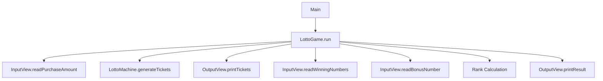

# Kotlin Lotto Application

## Lessons Learned

### What I Learned
- **Modularization in Kotlin**:
    - How to break down code into reusable modules.
    - Strategies for managing overlapping logic across modules (e.g., interfaces, dependency injection).
- **Testing Tools**:
    - Experimented with testing frameworks like JUnit 5, overcoming the initial learning curve (e.g., parameterized tests, assertions).
    - The importance of isolating tests for modular components.

### Why These Resources Were Used
- **[Kotlin Docs](https://kotlinlang.org/docs/home.html)**: Official documentation for understanding modularization, visibility modifiers, and Kotlin-specific patterns.
- **[Kotlin Coding Conventions](https://kotlinlang.org/docs/coding-conventions.html)**: Practical examples of modular architecture in large-scale Kotlin projects.
- **[JUnit 5 Docs](https://junit.org/junit5/docs/current/user-guide/)**: Learned advanced testing techniques (e.g., `@Nested` classes, dynamic tests) to validate modular logic.

---

## Feature Implementation

### Core Features
1. **Purchase Validation**
    - Validates input amount is divisible by 1,000 KRW
    - Handles non-numeric input with proper error messaging

2. **Ticket Generation**
    - Creates specified number of lottery tickets
    - Each ticket contains 6 unique numbers (1-45 range)
    - Automatic sorting of numbers for display

3. **Winning Calculation**
    - Accepts and validates winning numbers (6 unique numbers)
    - Accepts and validates bonus number (distinct from winning numbers)
    - Compares tickets against winning combination
    - Calculates prize ranks according to official rules

4. **Result Presentation**
    - Displays purchased tickets
    - Shows detailed winning statistics
    - Calculates and formats return rate

5. **Error Handling**
    - Comprehensive input validation
    - Clear error messages with [ERROR] prefix
    - Graceful recovery from invalid inputs

## Architecture Overview

### Application Flow

### Key Components
1. **LottoGame (Controller)**
- Orchestrates application workflow
- Coordinates between input, processing, and output
- Maintains single responsibility principle

2. **InputView (Singleton)**

#### Responsibilities:    


 - Purchase amount validation  


- Winning number input parsing  


- Bonus number validation

#### Validation Includes:  


- Numeric checks  


- Range validation (1-45)  


- Uniqueness verification  


- Bonus number distinctness  


3. **LottoMachine (Singleton)**  

- Generates random lottery tickets using:  
````
Randoms.pickUniqueNumbersInRange(1, 45, 6)
````
- Ensures proper ticket count based on purchase amount


4. **Lotto (Model)**
   Immutable representation of single ticket

Validation rules:

- Exactly 6 numbers

- All numbers unique

- Numbers within 1-45 range

##### Provides:

- Number retrieval (sorted)

- Match counting functionality

- Bonus number checking

5. **OutputView (Singleton)**  

   **Display Functions:**

- Ticket count confirmation

- Formatted ticket display

- Winning statistics table

- Return rate calculation

**Formatting:**

- Consistent number presentation

- Proper currency formatting

- Clear section separation

6. **Rank (Enum)**
   **Defines prize tiers with:**

- Match requirements

- Prize amounts

- Bonus number conditions

- Provides conversion from match counts to ranks
